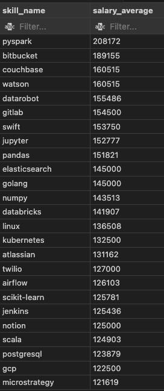

# Introduction
 📊 Analysis into job market data! 
 This analysis focuses on Data Analyst roles and explores insights such as:
 - Top paying jobs 💰
 - In-demand skills 🔥
 - High demand and high salary meeting points 📈  

🔎 SQL queries can be found on the [project_sql folder](/Project_sql/)  


# Background
This analysis is driven by my interest in SQL and Data analysis, and a quest to navigate the data analyst job market more effectively. This project was born from a desire to pinpoint top-paid and in-demand skills from the provided dataset.  
🗂️ Data for the project can be found on the [sqlliteviz website linked](https://sqliteviz.com/app/#/workspace?hide_schema=1:~:text=Search%20table-,jobs_2023,-company_dim) from Luke Barousse's [SQL Course](https://lukebarousse.com/sql).  
It is packed with insights on job titles, salaries, locations, essential skills, etc.

### The questions I sought to answer in this analysis included:
1. What are the top-paying jobs for my role? Data analyst in my case
2. What are the skills required for these top-paying roles?
3. What are the most in-demand skills for my role?
4. What are the top skills based on salary for my role?
5. What are the most optimal skills to learn?

# Tools Used
For a concise deep dive into the Data Analysis job Market, I harnessed the power of the below key tools:
-  **SQL**: This was the backbone of my analysis. Allowing me to query and modify the database for accurate and concise analysis.
-  **PostgreSQL (PGAdmin)**: This was my chosen database management system. This was chosen due to its ease of use and integration.
-  **Visual Studio Code**: My goto IDE for writing and executing SQL queries.
-  **Git & Github**: Eseential tool for Version control and sharing my SQL scripts and analysis results. It ensure for collaboration and project tracking. 

# The Analysis
Each Query for this project is aimed at investigating specific aspects of the Data Analyst job market.
The Analysis centered around Data Analyst roles and Remote opportunities.

### 1. Top-paying jobs for Data Analyst roles:
- This query was designed to identify the highest-paying job titles within the Data Analyst field. The goal is to help understand which specific roles or industries offer the most competitive salaries for data analysts. The Query used to answer this question can be found [Here](/Project_sql/1_top_paying_job.sql), and highlighted below.

```sql
SELECT
    name as Company_name,
    job_title,
    job_id,
    salary_year_avg,
    job_location,
    job_schedule_type,
    job_posted_date
FROM 
    job_postings_fact
LEFT JOIN 
    company_dim ON job_postings_fact.company_id = company_dim.company_id
WHERE 
    job_work_from_home = true AND 
    job_title_short = 'Data Analyst' AND 
    salary_year_avg is not null
ORDER BY salary_year_avg DESC
Limit 10;
```

The query revealed that top paying remote Data analyst jobs are from companies like Meta, AT&T, Mantys, etc.
The salary ranges from $184k - $650k with titles such as Director of Analytis, Director of Data insights, etc.  

  
*Table showing top paying Remote Data Analyst jobs for 2023*


### 2. Skills required for top-paying roles:
- This analysis seeks to pinpoint the key skills associated with the highest-paying data analyst positions. The aim is to identify which technical skills contribute to earning higher salaries in the field. The Query used to answer this question can be found [HERE](/Project_sql/2_top_paying_job_skills.sql) and  highlighted below.

```sql
WITH top_job AS (
    SELECT
    name as Company_name,
    job_id,
    job_title,
    job_location,
    job_schedule_type,
    salary_year_avg,
    job_posted_date
FROM 
    job_postings_fact
LEFT JOIN 
    company_dim ON job_postings_fact.company_id = company_dim.company_id
WHERE 
    job_work_from_home = true AND 
    job_title_short = 'Data Analyst' AND 
    salary_year_avg is not null
ORDER BY salary_year_avg DESC
Limit 10
)

SELECT
    top_job.job_title,
    top_job.job_location,
    top_job.job_schedule_type,
    top_job.salary_year_avg,
    sd.skills as skill_name
From skills_job_dim sj 
inner join top_job on sj.job_id = top_job.job_id
inner join skills_dim sd on sj.skill_id = sd.skill_id
;
```

This Query revealed that the top skills for high paying Data Analyst rolesinclude SQL, Python, Tableau and R, amongst others.  
  

  
*Chart showing the top skills for high paying Data Analyst roles. Chart was created by ChatGPT*

### 3. Most in-demand skills for Data Analysts:
- The objective here is to discover the skills most frequently required in job postings for data analysts. This analysis helps to reveal the most sought-after qualifications for anyone looking to stay competitive in the job market. The Query used to answer this question can be found [HERE](/Project_sql/3_top_demand_skills_DA.sql) and highlighted below.

```sql
select 
    skills as skill_name,
    count(skills) count_of_skill,
    round(avg(salary_year_avg),1) as salary_average
FROM
    job_postings_fact jf
INNER JOIN 
    skills_job_dim sj on sj.job_id = jf.job_id
INNER JOIN 
    skills_dim sd on sd.skill_id = sj.skill_id
WHERE 
    job_title_short = 'Data Analyst'
GROUP BY 
    sd.skills
ORDER BY 
    count_of_skill DESC
LIMIT 10;


--for Estonia
select 
    skills as skill_name,
    count(skills) count_of_skill,
    round(avg(salary_year_avg),1) as salary_average
FROM
    job_postings_fact jf
INNER JOIN 
    skills_job_dim sj on sj.job_id = jf.job_id
INNER JOIN 
    skills_dim sd on sd.skill_id = sj.skill_id
WHERE 
    job_title_short = 'Data Analyst' AND
    search_location like '%Estonia%'
GROUP BY 
    sd.skills
ORDER BY 
    count_of_skill DESC
LIMIT 10;
```
Query revealed that the most in-deman skills for Data analyst roles include SQL, Excel, Python, Tableau and PowerBI.  
For roles in Estonia, the most in-deman skills for Data analyst roles include SQL, Python, Tableau, Excel and Looker.  

  
*In-demands skills for Data Analysts*  


    
*In-demands skills for Data Analysts for Estonia*    

### 4. Top skills based on salary:
- This analysis focuses on understanding which skills correlate with higher salaries. It provides insight into which specific capabilities are valued more by employers, linking them to better compensation. The Query used to answer this question can be found [HERE](/Project_sql/4_top_paying_skills.sql) and highlighted below.

```sql
select 
    skills as skill_name,
    count(skills) count_of_skill,
    round(avg(salary_year_avg),0) as salary_average
FROM
    job_postings_fact jf
INNER JOIN 
    skills_job_dim sj on sj.job_id = jf.job_id
INNER JOIN 
    skills_dim sd on sd.skill_id = sj.skill_id
WHERE 
    job_title_short = 'Data Analyst' and 
    salary_year_avg IS NOT NULL AND
    job_work_from_home = true
GROUP BY 
    sd.skills
ORDER BY 
    salary_average DESC
LIMIT 25;
```

Analysis shows that there is large potential for Big Query (PySpark, Couchbase), ML skills (DataRobot, Jupyter), and python Libraries (Pandas, NumPy).  
Knowledge in development and deplyment tools has high potential for jobs (GitLab, Kubernetes, Airflow).  
Also Cloud computing is an essential skill for high opaying Data Analyst roles.  



### 5. Most optimal skills to learn:
- The final question aims to combine the results from the previous analyses to determine the best skills to invest time in learning. The idea is to identify skills that are both in demand and highly paid, making them the most strategic to learn for career advancement. The Query used to answer this question can be found [HERE](/Project_sql/5_optimal_skill.sql) and highlighted below.

```sql
SELECT
    skills_dim.skill_id,
    skills_dim.skills as skill_name,
    count(skills_dim.skills) as count_of_skill,
    round(avg(salary_year_avg),0) as salary_average
FROM 
    job_postings_fact
INNER JOIN 
    skills_job_dim ON job_postings_fact.job_id = skills_job_dim.job_id 
INNER JOIN 
    skills_dim ON skills_job_dim.skill_id = skills_dim.skill_id 
WHERE
    job_title_short = 'Data Analyst'
    AND salary_year_avg IS NOT NULL 
    AND job_work_from_home = True
GROUP BY
    skills_dim.skill_id
HAVING
    COUNT(skills_job_dim.job_id) > 10
ORDER BY
    salary_average DESC,
    count_of_skill DESC
LIMIT 25;
```

Each query is about combining demand, salary, and relevance of skills to help make informed decisions regarding career development as a Data Analyst. The breakdown is as follows:
- **Wide Salary Range**: Top 10 paying data analyst roles span from $184,000 to $650,000, indicating significant salary potential in the field.
- **Diverse Employers**: Companies like SmartAsset, Meta, and AT&T are among those offering high salaries, showing a broad interest across different industries.
- **Job Title Variety**: There's a high diversity in job titles, from Data Analyst to Director of Analytics, reflecting varied roles and specializations within data analytics.

 # Key Takeaway from Project
 This project helped me hone my SQL querying skills for database retrieval and Manipulation.  
 I have been able to add to my toolkit the following SQL superpowers:
 - **CTEs and Subqueries**: Mastered the art of creating Common Table Expressions and subqueries for faster querying and merging tables like a Pro. 🐐
 - **Data Aggregation Functions**: Brushed up on my understaning of aggregation functions like GroupBy, Count(), AVG(), etc. 🏋️‍♂️
 - **Analytics Superpower**: Developed on my problem solving and Analytical skills using real world dataset. Turned raw data into actionable insigths using SQL. 💪


 # Conclusions
### Insights from the Analysis include:
 1. Wide range of salary is available for a selection of remote Data Analyst jobs with salaries as low as $184k and as high as $650k.
 2. High paying jobs require advanced proficiency in SQL.
 3. Most in-demand jobs require SQL and Python proficiency, but this varies based on location.
 4. Based on Salary, computing, ML and Engineering skills are required for Data Analysts.
